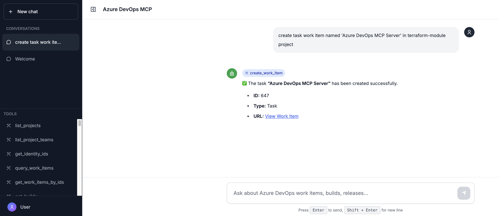
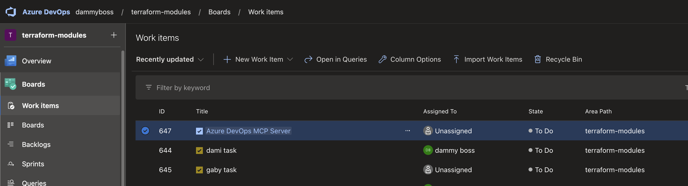
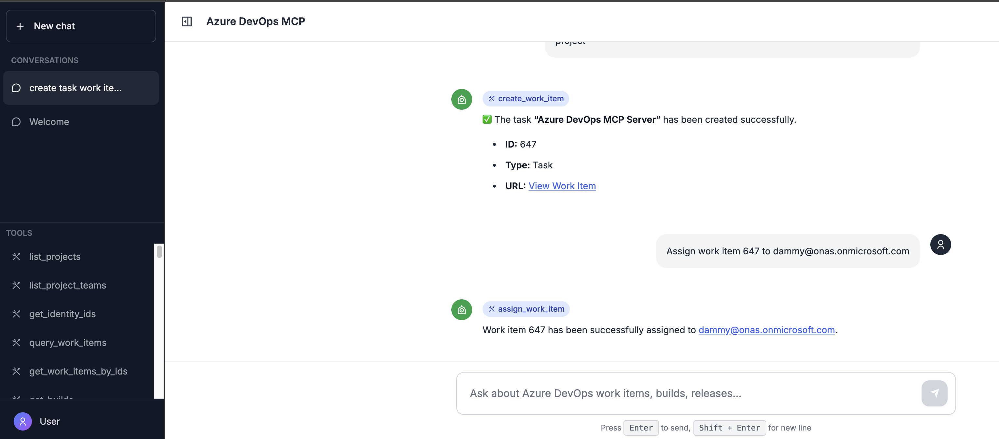
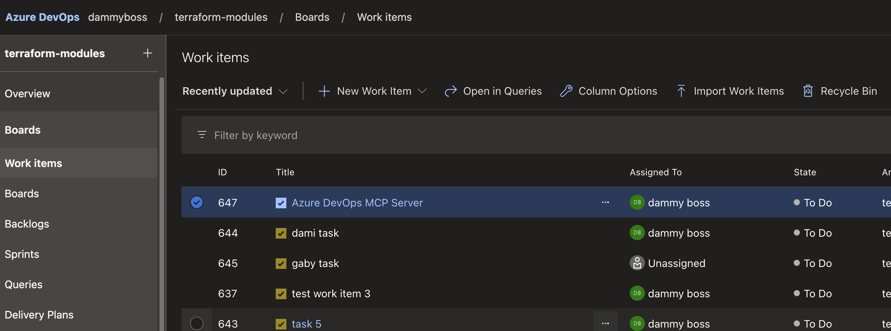

# Azure DevOps MCP Server Deployment Guide

This comprehensive guide provides step-by-step instructions for deploying an Azure DevOps Model Context Protocol (MCP) Server. The deployment consists of a Node.js backend server and a Next.js frontend application.

Choose your deployment method:
- **[Part 1: Local Development Setup](#part-1-local-development-setup)** - Run the application on your local machine
- **[Part 2: Azure Web App Deployment](#part-2-azure-web-app-deployment)** - Deploy to Azure Web Apps with CI/CD

---

# Part 1: Local Development Setup

This section covers running the Azure DevOps MCP Server locally for development and testing purposes.

## Table of Contents - Local Setup
1. [Local Prerequisites](#local-prerequisites)
2. [Installation](#installation)
3. [Configuration](#configuration)
4. [Running Locally](#running-locally)
5. [Local Development](#local-development)

---

## Local Prerequisites

Before starting local development, ensure you have:

- **Node.js 18+** installed on your machine
- **npm** or **yarn** package manager
- **Azure DevOps organization** with a Personal Access Token (PAT) with read/write permissions
- **(Optional)** Azure OpenAI service for natural language processing
- **Git** for cloning the repository

---

## Installation

### Step 1: Clone the Repository

Clone the Azure DevOps MCP Server repository to your local machine:

```bash
git clone <repo-url>
cd azure-devops-mcp
```

### Step 2: Install Root Dependencies

Install the root-level dependencies (includes `concurrently` for running both server and frontend):

```bash
npm install
```

### Step 3: Install Server Dependencies

Navigate to the server directory and install dependencies:

```bash
cd server
npm install
cd ..
```

### Step 4: Install Frontend Dependencies

Navigate to the frontend directory and install dependencies:

```bash
cd frontend
npm install
cd ..
```

---

## Configuration

### Step 5: Set Up Environment Variables

Create your environment configuration file:

1. **Copy the example file:**
   ```bash
   cp .env.example .env
   ```

2. **Edit `.env` with your credentials:**
   ```env
   # Azure DevOps Configuration
   AZURE_DEVOPS_ORG_URL=https://dev.azure.com/<your-organization>
   AZURE_DEVOPS_PAT=<your-personal-access-token>
   AZURE_DEVOPS_PROJECT=<Your-Project-Name>
   
   # Server Configuration
   PORT=3001
   MCP_SERVER_PORT=3002
   NODE_ENV=development
   
   # Frontend Configuration
   NEXT_PUBLIC_API_URL=http://localhost:3001
   
   # Azure OpenAI Configuration (Optional)
   AZURE_OPENAI_API_KEY=<your-openai-key>
   AZURE_OPENAI_ENDPOINT=https://<your-openai-endpoint>.openai.azure.com
   AZURE_OPENAI_API_VERSION=2025-01-01-preview
   AZURE_OPENAI_DEPLOYMENT_NAME=gpt-4
   ```

**Configuration Guide:**

| Variable | Description | Example |
|----------|-------------|---------|
| `AZURE_DEVOPS_ORG_URL` | Your Azure DevOps organization URL | `https://dev.azure.com/mycompany` |
| `AZURE_DEVOPS_PAT` | Personal Access Token from Azure DevOps | Get from Azure DevOps User Settings |
| `AZURE_DEVOPS_PROJECT` | Default project to work with | `MyProject` |
| `PORT` | Backend server port | `3001` |
| `NEXT_PUBLIC_API_URL` | Backend API URL for frontend | `http://localhost:3001` |
| `AZURE_OPENAI_API_KEY` | Azure OpenAI API key (optional) | From Azure Portal |
| `AZURE_OPENAI_ENDPOINT` | OpenAI service endpoint | `https://myopenai.openai.azure.com` |

**Getting Your Azure DevOps PAT:**
1. Go to Azure DevOps → User Settings → Personal Access Tokens
2. Create new token with required permissions:
   - Work Items (Read & Write)
   - Code (Read)
   - Build (Read)
   - Release (Read)
3. Copy the token and add to `.env` file

---

## Running Locally

### Option 1: Run Both Services Concurrently (Recommended)

From the root directory, run both server and frontend together:

```bash
npm run dev
```

**What this does:**
- Starts the MCP server on `http://localhost:3001`
- Starts the frontend on `http://localhost:3000`
- Runs both with hot-reload enabled
- Shows logs from both services in one terminal

**Access the application:**
- Frontend UI: `http://localhost:3000`
- Backend API: `http://localhost:3001`
- Health check: `http://localhost:3001/health`

---

### Option 2: Run Services Separately

If you prefer to run services in separate terminals for better log management:

**Terminal 1 - Start the MCP Server:**
```bash
cd server
npm run dev
```

Server will be available at `http://localhost:3001`

**Terminal 2 - Start the Frontend:**
```bash
cd frontend
npm run dev
```

Frontend will be available at `http://localhost:3000`

---

## Local Development

### Using the Frontend UI

1. Open your browser and navigate to `http://localhost:3000`
2. The sidebar displays all 51 available Azure DevOps tools
3. **Natural Language Queries:** Type queries like:
   - "List all projects"
   - "Create a bug titled 'Login issue'"
   - "Show me recent builds"
4. **Manual Tool Selection:** Click on a tool in the sidebar to execute it
5. View results in the chat-style interface

### Testing the API Directly

You can test the backend API using curl or tools like Postman:

**Health Check:**
```bash
curl http://localhost:3001/health
```

**List Available Tools:**
```bash
curl http://localhost:3001/api/tools
```

**Execute a Tool:**
```bash
curl -X POST http://localhost:3001/api/tools/list_projects \
  -H "Content-Type: application/json" \
  -d '{}'
```

**Chat Completion:**
```bash
curl -X POST http://localhost:3001/api/chat \
  -H "Content-Type: application/json" \
  -d '{"message": "List all projects"}'
```

### Using as MCP Server (stdio mode)

For integration with Claude Desktop, Cursor, or other MCP clients:

1. **Build the server:**
   ```bash
   cd server
   npm run build
   ```

2. **Configure your MCP client:**
   ```json
   {
     "mcpServers": {
       "azure-devops": {
         "command": "node",
         "args": ["/path/to/azure-devops-mcp/server/dist/index.js", "--stdio"],
         "env": {
           "AZURE_DEVOPS_ORG_URL": "https://dev.azure.com/your-org",
           "AZURE_DEVOPS_PAT": "your-pat-token",
           "AZURE_DEVOPS_PROJECT": "Your-Project"
         }
       }
     }
   }
   ```

### Development Tips

**Hot Reload:**
- Both server and frontend support hot-reload during development
- Changes to TypeScript files in `/server/src` will trigger automatic rebuild
- Changes to React components in `/frontend` will refresh the browser

**Debugging:**
- Server logs appear in the terminal
- Frontend logs appear in browser console
- Check `http://localhost:3001/health` if backend isn't responding
- Verify environment variables are loaded correctly

**Common Local Development Issues:**

| Issue | Solution |
|-------|----------|
| Port already in use | Kill process on port 3001/3000 or change PORT in `.env` |
| Frontend can't connect | Verify `NEXT_PUBLIC_API_URL` matches server port |
| Azure DevOps API errors | Check PAT permissions and expiration date |
| Build errors | Delete `node_modules` and run `npm install` again |

---

# Part 2: Azure Web App Deployment

This section covers deploying the Azure DevOps MCP Server to Azure Web Apps for production use with automated CI/CD pipelines.

## Table of Contents - Azure Deployment
1. [Azure Prerequisites](#azure-prerequisites)
2. [Infrastructure Setup](#infrastructure-setup)
3. [Backend Deployment](#backend-deployment)
4. [Frontend Deployment](#frontend-deployment)
5. [CI/CD Pipeline Configuration](#cicd-pipeline-configuration)
6. [Testing and Monitoring](#testing-and-monitoring)

---

## Azure Prerequisites

Before starting Azure deployment, ensure you have:
- An active Azure subscription
- Azure CLI installed and configured
- Azure DevOps organization and project
- Personal Access Token (PAT) with required permissions
- Azure OpenAI service provisioned
- Source code repository with backend and frontend applications

---

## Infrastructure Setup

### Step 1: Authenticate with Azure

First, log in to your Azure account using the Azure CLI. This establishes an authenticated session for subsequent commands.

```bash
az login
```

**What this does:** Opens a browser window for interactive authentication. Once completed, you'll have access to your Azure subscriptions.

---

### Step 2: Create a Resource Group

Create a dedicated resource group to organize all related Azure resources for the MCP server deployment.

```bash
az group create \
  --name <RESOURCE_GROUP_NAME> \
  --location <LOCATION>
```

**Parameters explained:**
- `--name`: The name of the resource group (e.g., `rg-devops-mcp`)
- `--location`: Azure region where resources will be deployed (e.g., `eastus`, `westus2`, `westeurope`)

**Why this matters:** Resource groups provide a logical container for managing and organizing Azure resources. All resources for this project will be grouped together for easier management and billing.

---

### Step 3: Create an App Service Plan

Provision an App Service Plan that defines the compute resources for hosting the web applications.

```bash
az appservice plan create \
  --name <APP_SERVICE_PLAN_NAME> \
  --resource-group <RESOURCE_GROUP_NAME> \
  --sku B1 \
  --is-linux
```

**Parameters explained:**
- `--name`: Name of the App Service Plan
- `--resource-group`: The resource group created in Step 2
- `--sku`: Pricing tier (`B1` = Basic tier with 1 core, 1.75 GB RAM)
- `--is-linux`: Specifies Linux-based hosting environment

**Cost consideration:** The B1 SKU is cost-effective for development/testing. For production, consider upgrading to S1 or higher for better performance and SLA.

---

### Step 4: Check Available Runtimes (Optional)

Verify the available Node.js runtime versions supported by Azure Web Apps on Linux.

```bash
az webapp list-runtimes --os-type linux
```

**Why check this:** Ensures you select a supported runtime version for your application. This helps avoid compatibility issues during deployment.

---

## Backend Deployment

### Step 5: Create the Backend Web App

Deploy a Web App instance for the Node.js backend server.

```bash
az webapp create \
  --name <BACKEND_WEBAPP_NAME> \
  --resource-group <RESOURCE_GROUP_NAME> \
  --plan <APP_SERVICE_PLAN_NAME> \
  --runtime "NODE|20-lts"
```

**Parameters explained:**
- `--name`: Unique name for the web app (must be globally unique across Azure)
- `--resource-group`: Resource group containing the app
- `--plan`: App Service Plan created in Step 3
- `--runtime`: Node.js LTS version 20

**Result:** Creates a web app accessible at `https://<BACKEND_WEBAPP_NAME>.azurewebsites.net`

---

### Step 6: Configure Backend Application Settings

Set environment variables required by the backend application. These settings configure Azure DevOps integration, OpenAI connectivity, and server configuration.

```bash
az webapp config appsettings set \
  --name <BACKEND_WEBAPP_NAME> \
  --resource-group <RESOURCE_GROUP_NAME> \
  --settings \
    AZURE_DEVOPS_ORG_URL="https://dev.azure.com/<YOUR_ORG_NAME>" \
    AZURE_DEVOPS_PAT="<YOUR_DEVOPS_PAT_TOKEN>" \
    AZURE_DEVOPS_PROJECT="<YOUR_PROJECT_NAME>" \
    AZURE_OPENAI_API_KEY="<YOUR_OPENAI_API_KEY>" \
    AZURE_OPENAI_ENDPOINT="https://<YOUR_OPENAI_RESOURCE_NAME>.openai.azure.com" \
    AZURE_OPENAI_API_VERSION="2025-01-01-preview" \
    AZURE_OPENAI_DEPLOYMENT_NAME="<YOUR_MODEL_DEPLOYMENT_NAME>" \
    NODE_ENV="production" \
    PORT=3001 \
    MCP_SERVER_PORT=3002 \
    ALLOWED_ORIGINS="https://<FRONTEND_WEBAPP_NAME>.azurewebsites.net"
```

**Configuration variables explained:**

| Variable | Purpose |
|----------|---------|
| `AZURE_DEVOPS_ORG_URL` | Your Azure DevOps organization URL |
| `AZURE_DEVOPS_PAT` | Personal Access Token for authenticating with Azure DevOps |
| `AZURE_DEVOPS_PROJECT` | Name of the Azure DevOps project to connect to |
| `AZURE_OPENAI_API_KEY` | API key for Azure OpenAI service |
| `AZURE_OPENAI_ENDPOINT` | Endpoint URL for Azure OpenAI resource |
| `AZURE_OPENAI_API_VERSION` | API version for OpenAI service calls |
| `AZURE_OPENAI_DEPLOYMENT_NAME` | Name of the deployed AI model |
| `NODE_ENV` | Node.js environment (`production` enables optimizations) |
| `PORT` | Main application port |
| `MCP_SERVER_PORT` | Port for MCP server functionality |
| `ALLOWED_ORIGINS` | CORS configuration for frontend access |

**Security Note:** Replace placeholder values with your actual credentials. Consider using Azure Key Vault for sensitive values in production.

---

## Frontend Deployment

### Step 7: Create the Frontend Web App

Deploy a separate Web App instance for the Next.js frontend application.

```bash
az webapp create \
  --name <FRONTEND_WEBAPP_NAME> \
  --resource-group <RESOURCE_GROUP_NAME> \
  --plan <APP_SERVICE_PLAN_NAME> \
  --runtime "NODE|20-lts"
```

**Why separate apps:** 
- Enables independent scaling of frontend and backend
- Simplifies deployment and rollback procedures
- Allows different monitoring and logging configurations
- Better security isolation

**Result:** Creates a web app accessible at `https://<FRONTEND_WEBAPP_NAME>.azurewebsites.net`

---

### Step 8: Configure Frontend Application Settings

Set environment variables for the Next.js frontend to communicate with the backend.

```bash
az webapp config appsettings set \
  --name <FRONTEND_WEBAPP_NAME> \
  --resource-group <RESOURCE_GROUP_NAME> \
  --settings \
    NEXT_PUBLIC_API_URL="https://<BACKEND_WEBAPP_NAME>.azurewebsites.net" \
    SCM_DO_BUILD_DURING_DEPLOYMENT="true"
```

**Configuration variables explained:**

| Variable | Purpose |
|----------|---------|
| `NEXT_PUBLIC_API_URL` | Backend API endpoint for frontend to call |
| `SCM_DO_BUILD_DURING_DEPLOYMENT` | Enables Azure to run build commands during deployment (Kudu build) |

**Next.js Note:** Variables prefixed with `NEXT_PUBLIC_` are exposed to the browser and embedded during build time.

---

## CI/CD Pipeline Configuration

### Step 9: Azure DevOps Pipeline Setup

Create an Azure DevOps pipeline to automate the build and deployment process. This pipeline consists of four stages: building the backend, building the frontend, deploying the backend, and deploying the frontend.

#### Pipeline Configuration File (`azure-pipelines.yml`)

```yaml
trigger:
  none

pool:
  vmImage: 'ubuntu-latest'

variables:
  - group: webappenv
```

**Pipeline structure explained:**

- `trigger: none`: Manual trigger only (no automatic builds on code commits)
- `pool`: Specifies Ubuntu-based build agent
- `variables`: References a variable group named `webappenv` containing shared configuration

**Variable group setup:** Create a variable group in Azure DevOps Library with these variables:
- `NODE_VERSION`: e.g., "20.x"
- `BACKEND_WEBAPP_NAME`: Your backend web app name (e.g., "my-mcp-backend")
- `FRONTEND_WEBAPP_NAME`: Your frontend web app name (e.g., "my-mcp-frontend")
- `azureSubscription`: Your Azure service connection name
- `NEXT_PUBLIC_API_URL`: Your backend URL (e.g., "https://my-mcp-backend.azurewebsites.net")

---

#### Stage 1: Build Backend

This stage compiles the Node.js backend application and prepares it for deployment.

```yaml
stages:
  - stage: BuildBackend
    displayName: 'Build Backend'
    jobs:
      - job: BuildBackendJob
        displayName: 'Build Backend Application'
        steps:
          - checkout: self
          
          - task: NodeTool@0
            displayName: 'Set up Node.js'
            inputs:
              versionSpec: '$(NODE_VERSION)'

          - script: |
              pwd
              ls -la
              echo ""
              echo "Server Directory: $(System.DefaultWorkingDirectory)/server"
              ls -la $(System.DefaultWorkingDirectory)/server
              echo ""
              echo "Frontend Directory: $(System.DefaultWorkingDirectory)/frontend"
              ls -la $(System.DefaultWorkingDirectory)/frontend
              echo ""
            displayName: 'Get File Location'
          
          - script: |
              cd $(System.DefaultWorkingDirectory)/server
              npm ci
              npm run build

              # Copy only what Azure needs
              cp package.json dist/
              cp package-lock.json dist/
              
              # Install production dependencies WITHOUT deleting compiled files
              npm install --omit=dev --prefix dist
            displayName: 'Build backend'
```

**Step breakdown:**

1. **Checkout**: Retrieves source code from repository
2. **NodeTool@0**: Installs specified Node.js version
3. **Get File Location**: Diagnostic step to verify directory structure
4. **Build backend**:
   - `npm ci`: Clean install of dependencies (faster and more reliable than `npm install`)
   - `npm run build`: Compiles TypeScript to JavaScript in `dist/` folder
   - Copies `package.json` and `package-lock.json` to `dist/` for Azure deployment
   - Installs only production dependencies in `dist/` folder (excludes devDependencies)

```yaml
          - task: ArchiveFiles@2
            inputs:
              rootFolderOrFile: '$(System.DefaultWorkingDirectory)/server/dist'
              includeRootFolder: false
              archiveType: 'zip'
              archiveFile: '$(Build.ArtifactStagingDirectory)/backend.zip'
          
          - publish: $(Build.ArtifactStagingDirectory)/backend.zip
            artifact: backend-drop
```

**Artifact creation steps:**

5. **ArchiveFiles@2**: Creates a ZIP archive of the `dist/` folder
   - `includeRootFolder: false`: Excludes the `dist/` folder name from archive (files at root)
   - Stores ZIP in build staging directory
6. **Publish**: Makes the ZIP available as a pipeline artifact named `backend-drop` for deployment stage

**Why this approach:** Separating build and deployment stages enables redeployment without rebuilding, faster rollbacks, and better pipeline organization.

---

#### Stage 2: Build Frontend

This stage compiles the Next.js frontend application and packages it for deployment.

```yaml
  - stage: BuildFrontend
    displayName: 'Build Frontend'
    condition: succeeded()
    jobs:
      - job: BuildFrontendJob
        displayName: 'Build Frontend Application'
        steps:
          - checkout: self

          - script: |
              pwd
              ls -la
              echo ""
              echo "Server Directory: $(System.DefaultWorkingDirectory)/server"
              ls -la $(System.DefaultWorkingDirectory)/server
              echo ""
              echo "Frontend Directory: $(System.DefaultWorkingDirectory)/frontend"
              ls -la $(System.DefaultWorkingDirectory)/frontend
              echo ""
            displayName: 'Get File Location'
          
          - task: NodeTool@0
            displayName: 'Set up Node.js'
            inputs:
              versionSpec: '$(NODE_VERSION)'
          
          - script: |
              cd $(System.DefaultWorkingDirectory)/frontend
              npm ci
              npm run build
              npm install --omit=dev
            displayName: 'Build frontend'
            env:
              NEXT_PUBLIC_API_URL: $(NEXT_PUBLIC_API_URL)

          - script: |
              echo ""
              echo "Listing files before archiving..."
              ls -R $(System.DefaultWorkingDirectory)/frontend
              echo ""
            displayName: 'List Frontend Files Before Archiving'

          - script: |
              echo ""
              echo "Listing frontend folder:"
              ls -la $(System.DefaultWorkingDirectory)/frontend
              echo ""
              echo "Listing node_modules:"
              ls -la $(System.DefaultWorkingDirectory)/frontend/node_modules
              echo ""
              echo "Listing node_modules/.bin:"
              ls -la $(System.DefaultWorkingDirectory)/frontend/node_modules/.bin
              echo ""
              echo "Listing node_modules/next:"
              ls -la $(System.DefaultWorkingDirectory)/frontend/node_modules/next
              echo ""
            displayName: 'Verify frontend build output'

          - task: ArchiveFiles@2
            inputs:
              rootFolderOrFile: '$(System.DefaultWorkingDirectory)/frontend'
              includeRootFolder: false
              archiveType: 'zip'
              archiveFile: '$(Pipeline.Workspace)/frontend-drop/frontend.zip'
              replaceExistingArchive: true
          
          - publish: $(Pipeline.Workspace)/frontend-drop/frontend.zip
            artifact: frontend-drop
```

**Frontend build steps explained:**

1. **Build frontend**:
   - `npm ci`: Clean install dependencies
   - `npm run build`: Runs Next.js production build (creates `.next/` folder)
   - `npm install --omit=dev`: Installs production-only dependencies
   - Environment variable `NEXT_PUBLIC_API_URL` is injected during build
2. **Diagnostic scripts**: Verify build output and critical dependencies (Next.js runtime)
3. **Archive and publish**: Package entire frontend directory including `.next/`, `node_modules/`, and config files

**Next.js deployment note:** The entire frontend folder is packaged because Next.js requires:

- `.next/` folder (compiled app)
- `node_modules/` (runtime dependencies)
- `package.json` and `next.config.js`

---

#### Stage 3: Deploy Backend

This stage deploys the built backend application to Azure Web App.

```yaml
  - stage: DeployBackend
    displayName: 'Deploy Backend'
    dependsOn: BuildBackend
    condition: succeeded()
    jobs:
      - deployment: DeployBackendJob
        environment: 'production'
        strategy:
          runOnce:
            deploy:
              steps:
                - task: AzureWebApp@1
                  inputs:
                    azureSubscription: '$(azureSubscription)'
                    appType: 'webAppLinux'
                    appName: '$(BACKEND_WEBAPP_NAME)'
                    package: '$(Pipeline.Workspace)/backend-drop/backend.zip'
                    runtimeStack: 'NODE|20-lts'
                    startUpCommand: 'node index.js'
```

**Deployment configuration explained:**

- `dependsOn: BuildBackend`: Ensures build completes before deployment
- `environment: 'production'`: Links deployment to Azure DevOps environment (enables approvals, deployment history)
- `strategy: runOnce`: Simple deployment strategy (alternatives: canary, rolling)
- **AzureWebApp@1 task**:
  - `azureSubscription`: Service connection for Azure authentication
  - `appType`: Specifies Linux-based Web App
  - `appName`: Target Web App name from variables
  - `package`: Path to the artifact from build stage
  - `startUpCommand`: Command executed to start the application (`node index.js`)

**Security best practice:** Configure the `production` environment in Azure DevOps with approval gates before allowing deployment.

---

#### Stage 4: Deploy Frontend

This stage deploys the built frontend application to Azure Web App.

```yaml
  - stage: DeployFrontend
    displayName: 'Deploy Frontend'
    dependsOn: [BuildFrontend, DeployBackend]
    condition: succeeded()
    jobs:
      - deployment: DeployFrontendJob
        environment: 'production'
        strategy:
          runOnce:
            deploy:
              steps:
                - task: AzureWebApp@1
                  inputs:
                    azureSubscription: '$(azureSubscription)'
                    appType: 'webAppLinux'
                    appName: '$(FRONTEND_WEBAPP_NAME)'
                    package: '$(Pipeline.Workspace)/frontend-drop/frontend.zip'
                    runtimeStack: 'NODE|20-lts'
                    startUpCommand: 'next start'
```

**Deployment dependencies explained:**

- `dependsOn: [BuildFrontend, DeployBackend]`: Waits for both frontend build AND backend deployment
  - **Why wait for backend:** Ensures backend API is available before frontend goes live
  - Prevents frontend errors from missing backend endpoints
- `startUpCommand: 'next start'`: Starts Next.js production server

**Deployment sequence:** BuildBackend → BuildFrontend → DeployBackend → DeployFrontend

This order ensures minimal downtime and proper service availability during deployment.

---

## Testing and Monitoring

### Step 10: Configure Health Check Endpoints

Enable Azure's health monitoring feature to automatically detect application issues.

```bash
# Configure backend health check
az webapp config set \
  --name <BACKEND_WEBAPP_NAME> \
  --resource-group <RESOURCE_GROUP_NAME> \
  --generic-configurations '{"healthCheckPath": "/health"}'

# Configure frontend health check
az webapp config set \
  --name <FRONTEND_WEBAPP_NAME> \
  --resource-group <RESOURCE_GROUP_NAME> \
  --generic-configurations '{"healthCheckPath": "/health"}'
```

**Health check benefits:**

- **Automatic monitoring**: Azure pings the health endpoint every minute
- **Auto-healing**: Can automatically restart unhealthy instances
- **Load balancing**: Removes unhealthy instances from load balancer rotation
- **Alerts**: Integrates with Azure Monitor for notifications

**Implementation requirement:** Your application must expose a `/health` endpoint that returns HTTP 200 when healthy.

---

### Step 11: Enable Application Logging

Configure logging to capture application output and diagnose issues.

```bash
# Enable application logging for backend
az webapp log config \
  --name <BACKEND_WEBAPP_NAME> \
  --resource-group <RESOURCE_GROUP_NAME> \
  --application-logging filesystem \
  --level information

# Enable application logging for frontend
az webapp log config \
  --name <FRONTEND_WEBAPP_NAME> \
  --resource-group <RESOURCE_GROUP_NAME> \
  --application-logging filesystem \
  --level information
```

**Logging levels:**

- `error`: Only errors
- `warning`: Errors and warnings
- `information`: Errors, warnings, and informational messages (recommended)
- `verbose`: All log messages including debug information

**Log storage:** Logs are stored in the App Service file system (`/home/LogFiles/`)

---

### Step 12: Stream Live Logs

View real-time application logs to monitor deployments and troubleshoot issues.

```bash
# Stream backend logs
az webapp log tail \
  --name <BACKEND_WEBAPP_NAME> \
  --resource-group <RESOURCE_GROUP_NAME>

# Stream frontend logs (in another terminal)
az webapp log tail \
  --name <FRONTEND_WEBAPP_NAME> \
  --resource-group <RESOURCE_GROUP_NAME>
```

**When to use log streaming:**

- During and immediately after deployment
- When troubleshooting application errors
- To verify environment variables are loaded correctly
- To monitor API calls and performance

**Alternative:** View logs in Azure Portal under **Monitoring → Log stream**

---

## Deployment Verification

After completing all steps, verify the deployment:

1. **Test backend health endpoint:**

   ```bash
   curl https://<BACKEND_WEBAPP_NAME>.azurewebsites.net/health
   ```

   Expected response: `{"status":"healthy"}` or similar

2. **Test frontend application:**
   - Navigate to `https://<FRONTEND_WEBAPP_NAME>.azurewebsites.net` in your browser
   - Verify the UI loads correctly
   - Test authentication and API connectivity

3. **Check Azure Portal:**
   - Verify both Web Apps show as "Running"
   - Review metrics for HTTP requests and response times
   - Check for any errors in Application Insights (if configured)

---

## Troubleshooting Tips

### Common Issues

**Build failures:**

- Verify Node.js version matches between local and pipeline
- Check for missing dependencies in `package.json`
- Review build logs for TypeScript compilation errors

**Deployment failures:**

- Ensure service connection has proper permissions
- Verify Web App names match variables
- Check that startup command is correct for your application structure

**Runtime errors:**

- Verify all environment variables are set correctly
- Check CORS configuration (ALLOWED_ORIGINS)
- Review application logs for specific error messages
- Ensure backend is deployed before frontend

**Networking issues:**

- Verify NEXT_PUBLIC_API_URL points to correct backend URL
- Check Azure DevOps PAT has required permissions
- Ensure Azure OpenAI endpoint is accessible

---

## Next Steps

Consider these enhancements for production:

1. **Security:**
   - Migrate secrets to Azure Key Vault
   - Enable managed identity for Azure service authentication
   - Configure custom domain with SSL certificate
   - Implement authentication (Azure AD, etc.)

2. **Performance:**
   - Enable Application Insights for detailed telemetrics
   - Configure autoscaling based on metrics
   - Add CDN for frontend static assets
   - Implement caching strategies

3. **Reliability:**
   - Set up deployment slots for staging
   - Configure automated backups
   - Implement blue-green deployment strategy
   - Add monitoring alerts and dashboards

4. **DevOps:**
   - Add automated testing to pipeline
   - Implement infrastructure as code (Bicep/Terraform)
   - Set up continuous deployment on code commits
   - Configure branch policies and code reviews

---

## Summary

This guide covered deploying an Azure DevOps MCP Server consisting of:

- **Infrastructure:** Resource group, App Service Plan, and two Web Apps
- **Backend:** Node.js server with Azure DevOps and OpenAI integration
- **Frontend:** Next.js application consuming backend API
- **CI/CD:** Azure DevOps pipeline with build and deployment automation
- **Monitoring:** Health checks, logging, and log streaming

Your MCP server is now deployed and ready for use at:

- Backend: `https://<BACKEND_WEBAPP_NAME>.azurewebsites.net`
- Frontend: `https://<FRONTEND_WEBAPP_NAME>.azurewebsites.net`

---

# Additional Resources

## About Azure DevOps MCP Server

An MCP (Model Context Protocol) server for querying Azure DevOps, with a frontend UI for chat completion. This project enables natural language interaction with Azure DevOps through a ChatGPT-style interface, powered by Azure OpenAI function calling.

### Screenshots







### 🎥 Quick Demo

Watch a quick demo of the Azure DevOps MCP server in action, creating and updating work items using natural language.

[](https://youtu.be/OjWEfAAoo_8)

---

## ✨ Features

- **MCP Server**: Implements the Model Context Protocol, exposing 51 Azure DevOps tools as MCP tools
- **Frontend UI**: A Next.js-based chat interface for interacting with the MCP server via natural language
- **Azure DevOps Integration**: Query work items, projects, builds, releases, repositories, pipelines, boards, and more using Azure DevOps REST API
- **Environment Configuration**: Store secrets and configuration in `.env` files
- **OpenAI Function Calling**: Uses Azure OpenAI to parse natural language queries and call the appropriate tools
- **Real-time Data**: All tools fetch live data from your Azure DevOps organization
- **Modern UI**: Responsive, ChatGPT-style interface with sidebar tool listing, conversation history, and markdown rendering

---

## 🏗️ Architecture Overview

```text
Azure DevOps MCP Server
├── Server (Node.js + TypeScript)
│   ├── MCP Server (Model Context Protocol)
│   ├── HTTP API (Express)
│   ├── Azure DevOps Client (Axios)
│   └── OpenAI Integration (function calling)
├── Frontend (Next.js 14 + React + Tailwind CSS)
│   ├── Chat interface with message bubbles
│   ├── Sidebar with tool listing
│   ├── Real-time tool execution
│   └── Responsive design
└── Configuration
    ├── .env (secrets)
    ├── Azure DevOps PAT
    └── Azure OpenAI credentials
```

---

## 📋 Available Tools (51 Total)

| Tool Name | Description | Required Parameters | Optional Parameters |
|-----------|-------------|---------------------|---------------------|
| `list_projects` | List all projects in the Azure DevOps organization | None | None |
| `list_project_teams` | Retrieve a list of teams for the specified Azure DevOps project. | project | None |
| `get_identity_ids` | Retrieve Azure DevOps identity IDs for a provided search filter. | searchFilter | None |
| `query_work_items` | Query work items using WIQL (Azure DevOps Query Language) | wiql | None |
| `get_work_items_by_ids` | Get work items by their IDs | ids | items |
| `get_builds` | Get recent builds for the project | None | definitionId |
| `get_releases` | Get recent releases for the project | None | top |
| `create_work_item` | Create a new work item in Azure DevOps (uses the default project configured in the environment). Provide work item type and title. The project is already set, so you do not need to specify it. | workItemType, title | None |
| `update_work_item` | Update fields of an existing work item in Azure DevOps. Provide the work item ID and a fields object with field names (e.g., System.Description) and new values. You can also add an optional comment. Common field mappings: "description" -> System.Description, "title" -> System.Title, "state" -> System.State, "assigned to" -> System.AssignedTo. | id, fields | None |
| `assign_work_item` | Assign a work item to a user. Provide the work item ID and the assignee (user display name or email). Optionally add a comment. | id, assignee | None |
| `list_repositories` | List repositories in a project (default project used if not specified) | None | project |
| `list_branches` | List branches in a repository | repositoryId | None |
| `list_pull_requests` | List pull requests in a repository or project | None | repositoryId |
| `get_pull_request` | Get details of a specific pull request | repositoryId, pullRequestId | None |
| `search_code` | Search for code across repositories | searchText | None |
| `search_work_items` | Search for work items using text search | searchText | None |
| `list_wikis` | List wikis in a project | None | project |
| `get_wiki_page` | Get content of a wiki page | wikiIdentifier | None |
| `list_team_iterations` | List iterations for a team | project, team | None |
| `list_test_plans` | List test plans in a project | project | None |
| `get_current_user` | Get the currently authenticated user details | None | None |
| `list_work_item_types` | List work item types available in a project | None | project |
| `list_iterations` | List iterations (sprints) for a project | None | project |
| `list_build_definitions` | List build definitions (pipelines) for a project | None | project |
| `list_release_definitions` | List release definitions for a project | None | project |
| `list_queries` | List saved work item queries in a project | None | project |
| `get_work_item_revisions` | Get revision history of a work item | id | None |
| `get_work_item_links` | Get links (relations) of a work item | id | None |
| `create_pull_request` | Create a new pull request | repositoryId, sourceBranch, targetBranch, title | None |
| `list_commits` | List commits in a repository | repositoryId | None |
| `get_file_content` | Get content of a file in a repository | repositoryId, path | None |
| `list_areas` | List areas (classification nodes) in a project | None | project |
| `list_iteration_capacities` | Get capacity for a team iteration | project, team, iterationId | None |
| `list_work_item_categories` | List work item categories in a project | None | project |
| `list_dashboards` | List dashboards in a project | None | project |
| `list_pipelines` | List pipelines (YAML pipelines) in a project | None | project |
| `list_test_suites` | List test suites in a test plan | project, planId | None |
| `list_variable_groups` | List variable groups for pipelines | None | project |
| `list_service_endpoints` | List service endpoints (service connections) | None | project |
| `list_tags` | List tags in a project | None | project |
| `list_team_members` | List members of a team | project, team | None |
| `list_boards` | List boards (work item boards) for a team | project, team | None |
| `list_board_columns` | List columns of a board | project, team, board | None |
| `list_board_rows` | List rows of a board | project, team, board | None |
| `list_work_item_states` | List states for a work item type | project, workItemType | None |
| `list_work_item_fields` | List work item fields (metadata) | None | project |
| `list_work_item_updates` | List updates (history) for a work item | id | None |
| `list_work_item_attachments` | List attachments for a work item | id | None |
| `list_work_item_comments` | List comments for a work item | id | None |
| `list_work_item_relations` | List relations (links) for a work item | id | None |
| `list_work_item_query_results` | Run a saved query and get results | project, queryId | None |

## 💬 Example Queries

### Work Items
- "List all active bugs in the terraform-modules project"
- "Create a new task titled 'Update documentation'"
- "Assign work item 123 to John Doe"
- "Update the description of work item 456 to 'Fixed login bug'"

### Projects & Teams
- "Show me all projects"
- "List teams in the terraform-modules project"
- "Who are the members of the terraform-modules team?"

### Builds & Releases
- "Show recent builds"
- "List release definitions"
- "What's the status of the latest release?"

### Repositories & Code
- "List repositories"
- "Search for 'TODO' in the code"
- "Show me the content of README.md in the main branch"

### Boards & Sprints
- "List boards for the terraform-modules team"
- "What are the columns on the Sprint board?"
- "Show iterations for the team"

## 🔧 Development

### Server Development

- The server is written in TypeScript and uses the `@modelcontextprotocol/sdk` package.
- To modify tools, edit `server/src/index.ts`.
- To change Azure DevOps API interactions, edit `server/src/azure-devops-client.ts`.
- Rebuild with `cd server && npm run build`.

### Frontend Development

- The frontend uses Next.js 14 with App Router and Tailwind CSS.
- Components are located in `frontend/components/`.
- The main chat interface is in `frontend/app/page.tsx`.
- Run frontend development server with `cd frontend && npm run dev`.

### Adding New Tools

1. Add a new tool definition to the `tools` array in `server/src/index.ts`.
2. Implement the corresponding method in `server/src/azure-devops-client.ts`.
3. Add a case in the MCP CallTool handler switch.
4. Add a case in the HTTP API endpoint switch.
5. Add a case in the chat completion endpoint switch.
6. Test the tool via HTTP POST or the frontend.

## 🚢 Deployment

### Server Deployment

Build the server for production:
```bash
cd server
npm run build
```

The output will be in `server/dist/`. You can run it with:
```bash
node dist/index.js
```

Set environment variables on your production server.

### Frontend Deployment

Build the frontend:
```bash
cd frontend
npm run build
```

You can deploy the `frontend/.next` directory to Vercel, Netlify, or any static hosting.

### Docker Deployment

A `Dockerfile` can be created to containerize both server and frontend.

## 🔒 Environment Variables

See `.env.example` for all available variables.

| Variable | Description | Required |
|----------|-------------|----------|
| `AZURE_DEVOPS_ORG_URL` | Your Azure DevOps organization URL (e.g., `https://dev.azure.com/your-org`) | Yes |
| `AZURE_DEVOPS_PAT` | Personal Access Token with appropriate permissions | Yes |
| `AZURE_DEVOPS_PROJECT` | Default project name | Yes |
| `PORT` | HTTP server port (default `3001`) | No |
| `NEXT_PUBLIC_API_URL` | Frontend API URL (default `http://localhost:3001`) | No |
| `AZURE_OPENAI_API_KEY` | Azure OpenAI API key | No (required for chat) |
| `AZURE_OPENAI_ENDPOINT` | Azure OpenAI endpoint | No |
| `AZURE_OPENAI_API_VERSION` | API version | No |
| `AZURE_OPENAI_DEPLOYMENT_NAME` | Deployment name (e.g., `gpt-4`) | No |

## 🛠️ Troubleshooting

- **Server fails to start**: Check that `.env` file exists in the root directory with correct Azure DevOps credentials.
- **Frontend cannot connect to server**: Ensure `NEXT_PUBLIC_API_URL` matches the server's port (default `http://localhost:3001`).
- **Azure DevOps API errors**: Verify your PAT has sufficient permissions (read access to projects, work items, builds, releases, etc.).
- **OpenAI function calling not working**: Ensure Azure OpenAI credentials are set and the deployment is active.
- **Tool returns empty results**: The Azure DevOps API may have no data; check your project/team names.

## ☕ Support the Developers

If you find this project helpful and would like to support our work, consider buying me a coffee!

[](https://buymeacoffee.com/promiseuche)

Your support helps me continue creating open-source tools and improving this project!

## 👨‍💻 About the Developers

**Promise Uche Nwachukwu**
*Microsoft MVP (AI & Azure) | DevOps/AI Engineer | Open Source Contributor*

**Damilola Onadeinde**
DevOps/AI Engineer | Cloud Infrastructure Specialist | Open Source Contributor*

Connect with me:
- GitHub: [@promiseuche](https://github.com/promiseuche)
- LinkedIn: [Promise Uche Nwachukwu](https://linkedin.com/in/nwachukwupromise)
- YouTube: [esimorphs](https://youtube.com/@esimorphs)

## 📝 License

MIT License - feel free to use for personal or commercial projects.

## 🆘 Support

For issues or questions:
1. Check the troubleshooting section above.
2. Review Azure DevOps REST API documentation.
3. Verify Azure OpenAI service status.
4. Check server logs for detailed error messages.

## 🎉 What's Next?

- Add support for Azure DevOps Analytics queries.
- Implement real-time notifications (webhooks).
- Add more tools (test runs, approvals, permissions).
- Enhanced UI with charts and dashboards.
- Multi‑organization support.
- Export functionality for query results.

---

*Built with ❤️ Promise Uche Nwachukwu In Collaboration With Damilola Onadeinde | [Support our work](https://buymeacoffee.com/promiseuche)*